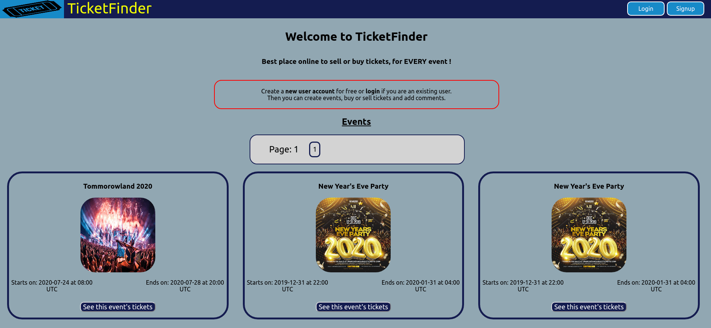
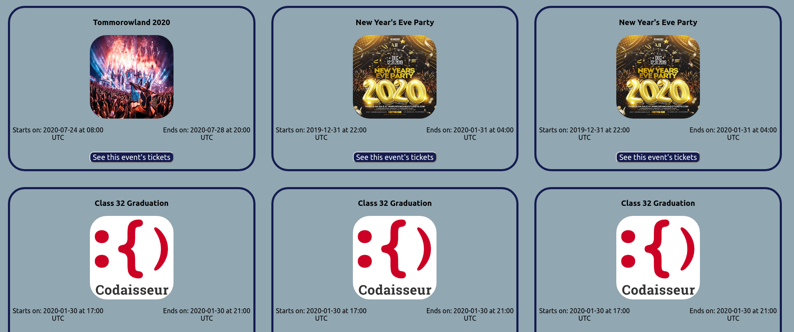
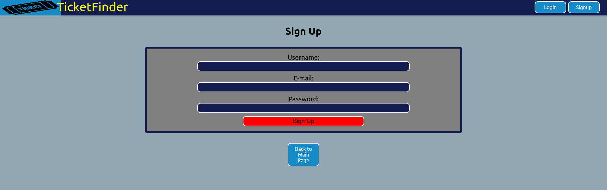
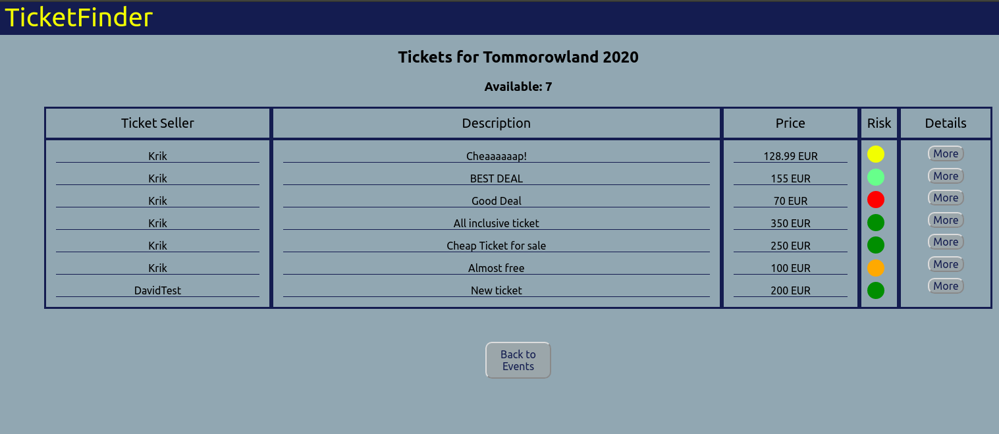
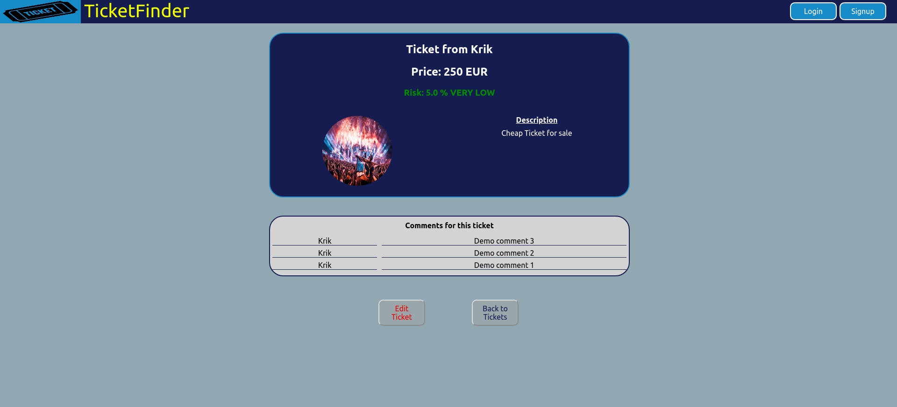

# TicketSwap Clone Frontend

## Codaisseur Bootcamp Final Assignment

### This is the frontend I built during the Codaisseur Final Asginment Project, a TicketSwap website simple clone. I completed the assignment, both frontend and backend in 4,5 days with 0 help.

### During my evaluation, I only heard positive feedback and the teacher was pretty excited for the quality of my work.

## Table of contents

- Framework/technologies
- Usage and Content

## Framework and technologies used

### Frontend

- This project was created with [ReactJS](https://reactjs.org/) framework
- Technologies : [redux](https://www.npmjs.com/package/redux), [redux-thunk](https://www.npmjs.com/package/redux-thunk), [superagent](https://www.npmjs.com/package/superagent)

### Backend

For details visit the [Backend repository](https://github.com/krik-chry/w8-final-server)

## Usage

### The user can see events that have not yet finished in the main page. There is also a login/signup button for users. In order to have acess to all features, the user must be logged in.

Main Page

SignUp Page

### The user can see an event's available tickets by clicking the "See this event's tickets" button, add tickets to this event, and check the risk of buying a ticket, calculated by an algorithm. The [algorithm](https://github.com/krik-chry/w8-final-client/blob/master/src/riskAlgorithm.js) is based on the assignment description :

- if the ticket is the only ticket of the author, add 10%
- if the ticket price is lower than the average ticket price for that event, that's a risk
  _ if a ticket is X% cheaper than the average price, add X% to the risk
  _ if a ticket is X% more expensive than the average price, deduct X% from the risk, with a maximum of 10% deduction
- if the ticket was added during business hours (9-17), deduct 10% from the risk, if not, add 10% to the risk
- if there are >3 comments on the ticket, add 5% to the risk
- The minimal risk is 5% (there's no such thing as no risk) and the maximum risk is 95%.

Event Tickets & Risk

### Each ticket has a "More" button that redirects to ticket details page. In the details page, the user can read or add comments for this ticket, as long as he is logged in. Additionaly,if the user is the owner of the ticket, there is the Edit Ticket option.

Ticket Details & Comments

